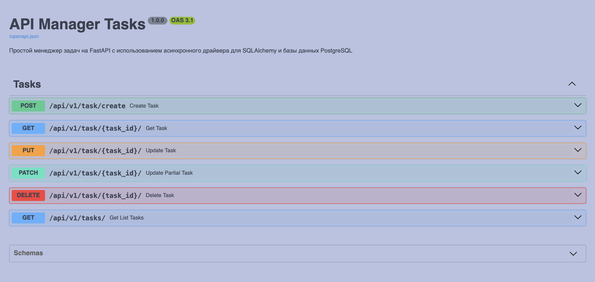

# FastAPI Task Manager

Асинхронный менеджер задач на FastAPI с использованием PostgreSQL, SQLAlchemy 2.0 и Docker.

## 🚀 Возможности

- Создание, чтение, обновление и удаление задач
- Пагинация и сортировка списка задач
- Поиск по задачам
- Логирование в Loki
- Документация API через Custom Swagger UI
- Асинхронная работа с базой данных
- Настройка CORS
- Контейнеризация с Docker

## 🛠 Технологии

- **FastAPI** - веб-фреймворк для создания API
- **SQLAlchemy 2.0** - ORM для работы с базой данных
- **PostgreSQL** - реляционная база данных
- **Alembic** - управление миграциями
- **Docker** и **Docker Compose** - контейнеризация
- **Poetry** - управление зависимостями
- **Pydantic** - валидация данных
- **Loki** - система логирования

## 🚀 Запуск проекта

### Требования

- Docker и Docker Compose
- Python 3.13+
- Poetry

### Установка

1. Клонируйте репозиторий:

   ```bash
   git clone https://github.com/powermacintosh/fastapi-task-manager.git
   cd fastapi-task-manager
   ```

2. Создайте файл `.env` на основе `.test.env`:

3. Запустите приложение с помощью Docker Compose:

```bash
docker-compose up --build -d
docker-compose logs -f web
docker-compose logs -f grafana
docker-compose logs -f loki
docker-compose logs -f promtail
docker-compose logs -f test_db
docker-compose logs -f db
docker-compose logs -f test
```

## 📚 Документация API

После запуска приложения документация API будет доступна по адресу:

- Swagger UI: http://localhost:5000/docs/
  

### Доступные эндпоинты

- `POST /api/v1/task/create` - Создать новую задачу
- `GET /api/v1/task/{task_id}/` - Получить задачу по ID
- `PUT /api/v1/task/{task_id}/` - Обновить задачу
- `PATCH /api/v1/task/{task_id}/` - Частично обновить задачу
- `DELETE /api/v1/task/{task_id}/` - Удалить задачу
- `GET /api/v1/tasks/` - Получить список задач с пагинацией

## 🧪 Запуск тестов

```bash
docker-compose run --rm test
```

## 🔧 Настройка окружения

Создайте файл `.env` в корне проекта со следующими переменными:

```env
MODE = DEVELOPMENT

# Database
DB_USER = postgres
DB_PASS = postgres
DB_HOST = db
DB_PORT = 5432
DB_NAME = fastapi-task-manager

# FastAPI
APP_PORT = 5000

# Loki
LOKI_PORT=3100

# Порт для Grafana
GRAFANA_PORT=3010
```

## 📊 Логирование

Логи приложения отправляются в Loki и доступны через Grafana.
**Grafana**: `http://localhost:3010`

### Подключение Loki к Grafana

**Loki-connection-url**: `http://loki:3100`

## 📄 Лицензия

Этот проект распространяется под лицензией MIT.
